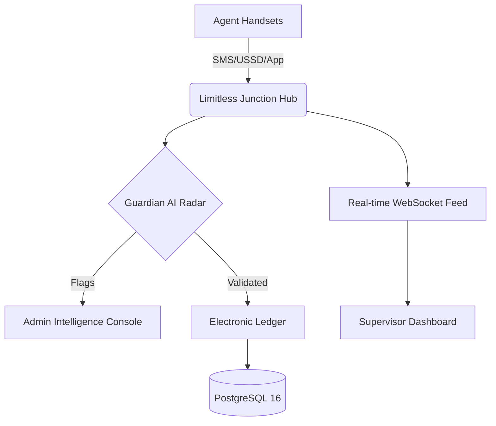

# Limitless Money Junction Track 💸
## "All your agents. One hub."

---

### 🏛️ The Mission
**Eliminating financial loss for Zimbabwean mobile money agents.**
The agent banking landscape in Zimbabwe is fragmented across EcoCash, OneMoney, InnBucks, and traditional bank lines. **Limitless Money Junction Track** normalizes this complexity into a single, real-time command center, ensuring absolute digital visibility over every cent in the network.

---

### 🚀 Core Innovations by Mathew Mabira

#### 1. Zero-Loss Reconciliation Engine
A specialized algorithm that cross-references provider statements against internal ledgers to identify discrepancies down to $0.01. It mathematically enforces the rule: `Cash (Physical) + Float (Digital) = Total Working Capital`.

#### 2. Guardian Security Radar
An intelligence-driven monitoring layer that flags suspicious patterns in real-time:
- **Smurfing Detection**: High-frequency small transactions.
- **Splitting Alerts**: Breaking large deposits to avoid thresholds.
- **Liquidity Forecasting**: Predictive branch top-up indicators.

#### 3. Omni-Hub Distributed Architecture
A protocol-agnostic interface that allows agents to register and track lines from any provider through a standardized UI, removing the need for multiple device management.

---

### 🛠️ Architecture Visualization

---

### 📐 Technical Pedigree

- **Frontend**: Glassmorphic React 19 / Tailwind CSS 4.0 (Enterprise Aesthetic).
- **Backend**: Node.js + tRPC (Type-safe RPC for sub-100ms latency).
- **Security**: Zero-Trust Handover policy for deactivated staff.
- **Orchestration**: Full Docker containerization (Postgres, Redis, Express, Vite).

---

### 🤵 Lead Architect: Mathew Mabira
Mathew is a specialized software engineer dedicated to high-fidelity financial infrastructure. His work on the **Limitless** platform represents a breakthrough in secure agent network oversight for the Zimbabwean market.

- **LinkedIn**: [Connect with Mathew Mabira](https://www.linkedin.com/in/mathew-mabira-24861632b)
- **Role**: Lead Systems Architect & Project Visionary

---

© 2026 Limitless Money Junction Group. Engineered for Technical Excellence.
